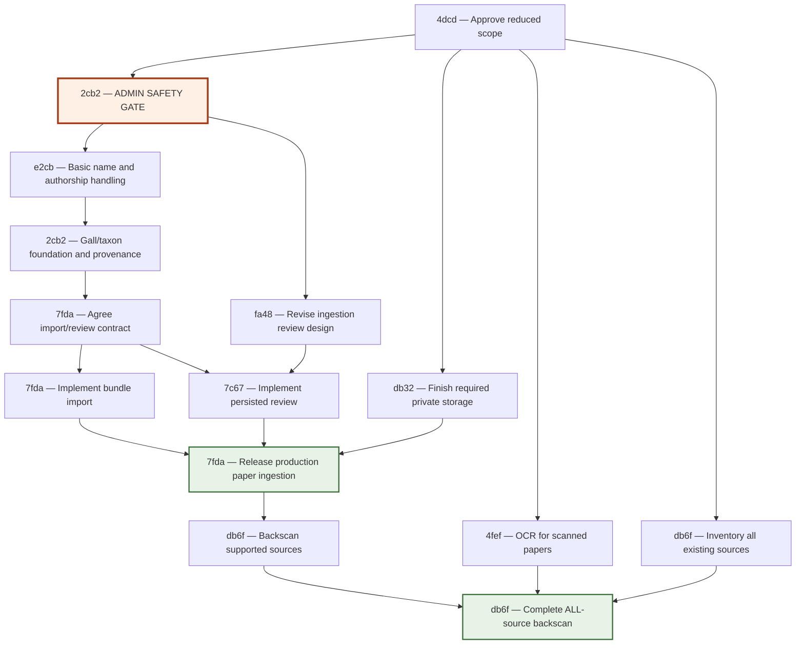

# Reconcile major initiatives and open matter portfolio

## Discussion baseline — 2026-09-10

This is an assessment for collaborative reconciliation, NOT an approved roadmap or priority order. Jeff makes scope, sequencing, and prioritization decisions. No existing matter statuses, dependency links, or priorities were changed. Baseline: 66 open matters (42 raw, 13 planned, 9 refined, 2 active), plus 2893 already done but still in matters/. This reconciliation record is additional to that baseline.

## Six initiatives

- Phenology: 439a. Draft PR https://github.com/jeffdc/gallformers/pull/578 is a concrete Elixir explorer and lazy gall-page timing implementation, not merely an investigation. Its branch updates 439a through September 8; local 439a lacks those updates. Release gates in the PR are maintainer acceptance and an audited curated-data import; empty tables alone do not deliver usable data. No complete GF–iNat crosswalk, scheduled imports, curation queue, or literature intake is required/included. The fixed reference is eastern/central North American climate normals across 25–55°N; ecological validity must not be inferred from implementation parity. Source: PR body and priv/phenology/README.md at head 5bbf886def03e0c5deedf4db84b646428495c324 in Megachile/gallformers. PR validation claims were read, not independently rerun.
- Taxonomic name authorship: e2cb, with 91cf for WCVP synonyms. The matter concerns authority attached to exact accepted scientific names and eligible scientific aliases, not contributor credit or bibliographic authorship. It includes review states and WCVP/already-extracted ingestion candidates, not arbitrary new LLM extraction. Current Species/Alias schemas lack the proposed fields.
- Species links to iNat: 8ba0 is broad and stale in part; exact taxon identifiers are concretely specified inside 2cb2. Existing public links search by name (ui_components.ex:647); archived/done 2708 and current InatImportComponent already deliver photo import with attribution. Gallformers Code observation links also exist. Taxon IDs, observation IDs, and gall codes must remain distinct. 2cb2 places external IDs on taxa, not gall structures. Clarify whether a standalone exact-link feature is wanted before the model cutover, versus delivering it within 2cb2; do not assume photo import/observation analytics are part of that first outcome.
- Proper taxonomy and independent gall identity: d108 + 2cb2, with 1832, 0a58, 3e8c downstream and 5c56/f49a needing reconciliation. 2cb2 is explicitly an unapproved draft awaiting Jeff's full review. Proposed model: galls own identifiable structures and gall content; taxa own names, authorship, classification, external IDs; associations express role/confidence and allow multiple taxa per gall and multiple galls per taxon. Existing IDs/URLs are preserved, no automatic biological merges. Current code still has species-backed gall_traits and species_taxonomy.
- DNA barcodes: 1374 maps directly but consists only of rationale. No usable scope yet for accession links vs sequence/specimen records, repositories, determinations, evidence, or workflow. Inference: biological evidence should not acquire the gall/species conflation; determine the intended consumer task before imposing a specimen system or declaring the full taxonomy project a blocker.
- LLM-assisted document processing: ce28 (north star), 9314 (partly stale phased plan), 7fda (older production umbrella), 7c67/fa48 (persisted review workflow/design), db32 (storage/publication), 4fef (OCR), 7a83 (narrow polish). Archived c744 is the later recorded architecture decision: independent Python producer, versioned artifact bundle, Elixir consumer/review. Do not reopen Python vs Elixir as an undecided question just because older matters still describe a port. Current Python born-digital pipeline exists; persisted Elixir/Oban infrastructure also exists but uses an older extraction contract. The checked-in review UI is a local-file PoC, not the bundle-backed persisted workflow. Bundle ingestion + WCVP enrichment/review bridge is referred to as 415f, but no corresponding matter was found in .mull; reconcile/restore ownership rather than silently inventing a duplicate. OCR is genuinely open; an OCR YAML sketch is not runnable capability. db32 storage APIs/infrastructure exist, but review-completion publication is not connected. fe8c is WCVP upload cleanup, not document ingestion.

## Complete primary categorization

Each initially open matter appears once below. Cross-initiative relationships above do not imply exclusive ownership.

- **Phenology:** `439a` Investigate Adam's phenology tool.

- **Taxonomic authorship:** `e2cb` Taxonomic name authorship.

- **iNaturalist integration:** `8ba0` iNaturalist integration.

- **Taxonomy and independent galls:** `d108` Generic nested infrageneric taxonomy; `2cb2` Multi-species gall model; `1832` Public organism taxon pages; `0a58` Generation field for gall traits; `3e8c` Gall merge workflow; `5c56` Species merge and split operations; `f49a` Taxonomic history / versioning.

- **DNA barcodes:** `1374` DNA barcode / taxonomic data integration.

- **LLM document processing:** `ce28` Greenfield LLM Gall Paper Ingestion Pipeline — Synthesis Plan; `9314` Path to north star — phased ingestion pipeline plan; `7fda` Source ingestion system — pipeline, review UI, Oban integration; `7c67` Persisted source ingestion review queue and detail workflow; `fa48` Source ingestion review UI design; `db32` Split source-ingestion storage into public published sources and private pipeline artifacts; `4fef` Source ingestion: OCR support for scanned PDFs; `7a83` Source ingestion pipeline polish: follow-ups from c744.

- **Identification and field use:** `85c0` Keys feature expansion; `67c9` Browse/filter galls by host family; `32a5` Mobile-first ID tool; `4c24` Progressive Web App / offline mode.

- **Host names and range curation:** `53cb` Genus-level host associations; `91cf` WCVP synonym import into aliases; `e79e` Common name import from external sources (POWO/GBIF/Wikidata); `b9e5` Bulk WCVP range backfill for all hosts; `618a` Continent-level include/exclude all in gall range curation.

- **WCVP operations:** `eff3` Investigate WCVP data update mechanism; `0ae0` WCVP worker machine for automated refresh and heavy operations; `f465` Preview Postgres setup with WCVP data; `fe8c` Low-priority cleanup: move WCVP dump upload behind storage boundary.

- **Organism scope and trait vocabulary:** `bf97` Parasites and inquilines expansion; `e29c` Leaf miners assessment; `eb47` GallOnt trait vocabulary integration.

- **Identity and permissions:** `0fc6` User management (Auth0); `3f58` Unify Auth0User and User into single user identity; `ec68` Permissions and roles refinement.

- **Contribution and curation:** `031d` Contributor pipeline; `09a0` Data change review queue; `4fcd` Structured observation intake; `4389` Notification system; `9005` Admin workflow improvements; `7cde` Data completeness scoring; `ede2` Audit trail.

- **Images:** `16bb` Image processing pipeline; `e7bb` AI-assisted image tagging.

- **Publishing and interoperability:** `cc12` Citation infrastructure (DOIs, how to cite); `29dc` Data interoperability (DarwinCore, GBIF, Wikidata); `2a27` RAG-optimized knowledge base export; `9737` Markdown site rendering for AI crawlers; `5d49` Oaks site integration.

- **Security and observability:** `220d` Rate limiting for all routes; `41cf` Reverse proxy for bot/crawler blocking; `cd9d` Observability and metrics infrastructure; `6d82` Analytics: track 404s on unrouted paths.

- **Architecture performance and API:** `8c5c` Codebase refactoring analysis; `9ad7` Audit LiveView usage — convert read-only pages to controllers; `8166` Flash of incorrect state during LiveView static render; `96b1` JS bundle size optimization; `74de` API v2 parity with public UI.

- **Testing and CI:** `1501` E2E test suite feasibility; `2648` JS test framework for range_map hook; `b016` Test suite alignment to testing philosophy; `1326` Upgrade CI GitHub Actions to Node.js 24 compatible versions.

- **Localization:** `ccee` Internationalization.

## Dependency interpretation and viable paths

Recorded graph: d108 and e2cb -> 2cb2 -> 1832, 3e8c, 0a58. This is recorded sequencing, not a priority recommendation. Fully finishing authorship/arbitrary-depth taxonomy is not logically necessary merely to distinguish a gall from a taxon, but changing this agreed sequencing would need an explicit decision. 2cb2 also needs to migrate e2cb eligibility away from gall_traits.undescribed to taxon-owned publication/provisional status.

Phenology can follow its bounded curated-data release independently of full iNat automation and taxonomy redesign. Integration risk: PR observations point at existing species-backed gall IDs and generation filtering reads name suffixes. Later gall/taxon separation and structured generation must migrate those consumers; evidence must not accidentally pool distinguishable galls/generations. This is a coupling, not proof that one whole initiative blocks the other.

Ingestion path under the latest recorded producer contract: born-digital bundles -> server import/WCVP enrichment/persistence -> evidence-aware human review -> approved domain writes/publication. OCR improves input coverage and can proceed against the same evidence contract without waiting for the public gall/taxon redesign. The approval/matching/writeback boundary must agree with authorship and gall/taxon ownership. No basis to make generic contributor roles, full audit history, or the entire taxonomy project mandatory predecessors to every extraction improvement.

Taxon identity is shared between authorship, exact iNat IDs, DNA determinations, and ingestion matching. This suggests agreeing ownership contracts before adding durable links, not making one enormous prerequisite project.

5c56 conflates taxon and gall merge/split; gall merge now belongs in 3e8c. Gall split has no clearly separated post-cutover owner. f49a is title-only despite 5c56 already proposing history; distinguish biological/name history from gall redirects and generic audit ede2. bf97's association foundation substantially overlaps 2cb2; remaining organism-expansion outcomes need definition. GallOnt term annotations/glossary can be independent, but phenotype imports must resolve gall forms, not just taxa.

Other recorded chains: 0fc6 -> ec68 -> contributor/review/intake/audit; 09a0 -> 4389; 16bb -> e7bb; 32a5 -> 4c24; cc12 -> 29dc; 7cde -> 2a27. Several nodes are title-only, so recorded blocking should not be mistaken for a demonstrated technical necessity. Outbound RAG/markdown publishing and image AI are separate from inbound paper processing.

## Reconciliation candidates, not automatic closures

- 439a: integrate draft-branch progress rather than overwrite it with the old investigation plan.
- 8ba0: separate already-delivered image import from exact identity and later observation/taxonomic-change features.
- 53cb, 618a, 2648: substantive implementation exists (placeholder model/ID behavior, continent controls, Vitest/range-map tests); verify whole intended outcome before closing.
- 1501: E2E infrastructure and suites already exist; clarify whether any feasibility question remains.
- db32, 8c5c, 74de, 9ad7, b016: mixed completed and remaining work; retain only current remaining scope after owner reconciliation.
- b9e5/eff3: SQLite-era operational instructions conflict with current Postgres architecture. 0ae0 remains the automation matter; code alone cannot prove the all-host backfill or preview provisioning was performed.
- 1326: dated upstream waiting assumptions need refreshing; no current upstream compatibility claim was established.
- 16bb: explicitly old design requiring reassessment; existing image import/upload/variant behavior is not an unstarted feature.
- 2893: already done, not part of the open-work count.

## Questions for Jeff before prioritization

1. Does the first iNat outcome mean curated exact taxon links, and should it stand alone or remain in the model cutover? Distinguish this from observation harvesting, phenology, and photo import.
2. What should a user be able to do with DNA data first: discover external accessions, curate sequence/specimen evidence, resolve uncertain taxa/generations, or something else? Matter 1374 does not say.
3. Is 2cb2 still the intended draft to review, with approval explicitly outstanding, or has the desired model changed?
4. Which outside commitments and present pain shape choices: Adam's release/data readiness, papers or collaborators, available barcode datasets, curator demand, document backlog, or operational exposure? No ranking can be inferred from old docket flags, effort estimates, or words like "critical" in raw matters.

## Evidence and limits

All 66 open matters were covered through read-only cluster research, with targeted current-source and archived-matter checks. Primary category membership was mechanically checked for omissions/duplicates. `mull doctor` reported zero integrity issues; that does not catch dangling IDs mentioned only in prose such as 415f. No code, tests, deployment, production data, or infrastructure was changed. Source inspection is not runtime/production verification. The only new record is this raw assessment; existing statuses, priorities, and dependency links remain unchanged. Next step is collaborative reconciliation, not implementation.

## Owner clarification — 2026-09-10

This section supersedes the initial open questions where answered; it does not approve 2cb2 or an implementation roadmap.

### Direction stated by Jeff

- Exact iNaturalist links are not critical or an immediate goal. They belong to biological taxa/species, not gall records. Treat them as taxonomy-related scope, not a competing standalone near-term initiative.
- DNA goal: store barcode evidence as a way to connect an undescribed gall to a barcoded organism. Jeff points to https://github.com/jeffdc/gallformers/issues/561 and expects further input from Adam (Megachile) may be needed.
- No outside commitments or deadlines are driving order. Jeff and Adam are assessing next steps together.
- Jeff considers real LLM-assisted paper ingestion the most important feature, explicitly including a backscan of ALL existing sources. This is the leading product outcome, not authorization to start implementation.
- Jeff believes ingestion is strongly dependent on taxonomy changes. Jeff and Adam also have unwritten ideas for finer-grained data provenance, fact extraction, and provenance mapping. Those ideas must be elicited before finalizing the domain/review design.

### Barcode issue evidence

Issue 561, by Megachile, says barcodes should ideally connect to galls through observations rather than directly; support multiple instances of multiple barcode regions (COI, cytb, ITS, etc.); plan robust integration with external databases. Hashing barcodes for joins is an exploratory suggestion, not an approved identity strategy. The issue has no comments at the time of this assessment. Do not assume one barcode per gall, one sequence per region, or that an identical sequence establishes species identity or an inducer role.

### Dependency finding: taxonomy and provenance need joint design

2cb2 currently moves legacy source links/excerpts to gall-level associations and explicitly defers general taxon-source links and source-backed organism assertions (line 114). Its gall_taxon_association stores a curated conclusion, role/confidence/host scope, but has no designed per-assertion evidence relation. This deferral may conflict with Jeff's intended evidence-aware ingestion outcome. Revisit it with Jeff/Adam rather than assume completing 2cb2 unchanged provides all ingestion prerequisites.

The existing Python artifact contract already retains per-field evidence: page/block/quote/offsets, original text, scientific name as written, and verifier verdict (services/source-ingestion/src/ingest/schemas.py Evidence, EvidenceCell, ScientificNameCell). The live SpeciesSource model remains a species/source link with prose and an optional alias. Extraction provenance is not yet a settled persistent model of accepted domain facts and their supporting/conflicting evidence.

Working distinction for discussion, not an approved schema:
1. Source claim: what a particular document says, with historical name and exact evidence.
2. Curated interpretation: which gall/taxon/host relationship or trait that claim supports, including uncertainty/context.
3. Published state: what Gallformers presents after review, potentially synthesized from multiple sources.

Taxon/gall identity and fact/evidence ownership should be designed together before production approval/writeback and corpus reconciliation are fixed. That does not require every ancillary taxonomy feature before improving extraction. No priority is assigned among implementation subprojects yet.

### Backscan implications to decide

The full existing-source corpus is in scope, not merely future uploads. A backscan should be discussed as reconciliation/enrichment of existing records and evidence, not bulk new-record creation. It needs a way to preserve existing curator work, surface disagreement, distinguish unsupported/not-mentioned from false, avoid duplicate facts/evidence on reruns, and track sources that cannot yet be processed. These are proposed requirements to validate with Jeff/Adam, not approved mechanics. Legacy links must not be retroactively represented as verified per-fact citations without evidence. Corpus-wide completion cannot be claimed from a successful sample.

### Next discussion

Invite Jeff's and Adam's unwritten provenance ideas before prescribing tables. Useful concrete case: two papers make different statements about the host, trait, or inducer of a gall. What should be retained separately, what can the curator conclude, and what should the visitor see? Clarify whether provenance is needed for individual trait values, gall-host and gall-organism associations, names/determinations, and manual observations as well as papers. Ask Adam what an observation/voucher means in the barcode workflow and how the sequenced organism's relationship to the gall is established.

## Provenance use cases clarified by Jeff — 2026-09-10

The core goal is QUERYABLE provenance: query individual facts/claims and discover where they come from. Jeff's examples:

- "Why is Gall X asserted to be on Host Y?"
- "Show me all of the galls/species that Source Z says occur on Host Y."

This is not merely citations on whole gall pages, an ingestion execution log, or a record of who edited a field. It requires identifying the particular assertion and linking it to its supporting source evidence, traversable both assertion-to-source and source-to-assertions with biological filters.

For the host example, the assertion is the relationship "Gall X occurs on Host Y", not Gall X alone. A source associated with Gall X must not automatically be treated as support for all of its hosts. Multiple supporting sources should remain independently traceable. The second query must return host assertions actually attributable to Source Z, not the intersection of every gall linked to Z and every gall currently linked to Host Y; those independent links do not establish provenance.

Current source check: GallHost stores the gall/host IDs and timestamps, without a source/evidence link. SpeciesSource stores species/source links with prose and optional alias metadata. These two separate relations cannot directly answer the requested questions reliably. The new gall/taxon model must preserve which entity and relationship a source statement concerns rather than conflating a gall structure with its inducer taxon.

Working design direction, not an approved storage schema: addressable domain assertions linked to one or more source evidence records (source plus quotation/page or other available locator). Existing extraction evidence can supply candidate links; approval must retain them instead of flattening all output into unreferenced canonical fields. This requirement alone does not mandate a graph database, universal claim language, or a full conflict-resolution system.

Open semantic boundary: should "Source Z says" include source claims not currently accepted by Gallformers, clearly distinguished from accepted claims, or only approved claims? Jeff has not yet specified this. Do not assume rejected/superseded-claim retention policy or public UI details from the two use cases.

## Decision: provenance queries cover accepted claims only — 2026-09-10

Jeff clarified that the provenance queries discussed above cover ONLY accepted claims. This resolves the preceding open semantic question.

- "Why is Gall X asserted to occur on Host Y?" returns supporting source evidence for the accepted gall-host assertion.
- "Show what Source Z says occurs on Host Y" returns accepted assertions attributed to Source Z, filtered by Host Y. It is not an exhaustive inventory of everything the paper claims.
- Extraction candidates do not enter this queryable accepted-claim set merely because a model extracted or verified them. Approval must preserve the specific supporting-evidence link.
- A source's association with a gall remains insufficient to establish support for every accepted fact about that gall.

Rejected, pending, or superseded claims are outside these provenance queries. This decision does not prescribe deleting extraction artifacts, define review/audit retention, or require a separate comprehensive store of unaccepted claims. No storage schema or implementation sequence is approved by this clarification.

## Next design question: initial provenance coverage — 2026-09-10

Proposal for Jeff's review, NOT an approved scope: make accepted evidence queryable for (1) gall-host associations, (2) gall-organism associations including ecological role, and (3) individual structured gall trait values. These cover the host queries and the main biological outputs of paper ingestion. Ask whether geographic occurrence assertions also belong in the initial set. Do not conflate source-reported occurrence with gall range inferred from host distribution.

Taxonomic name authorship remains its existing separate workstream; bibliographic citation, extraction logs, and record edit history do not substitute for biological assertion provenance. Implementation should follow the coverage decision, not precede it. Current 2cb2 places hosts and traits on the independent gall and models organism associations, but its explicit source-backed-assertion deferral must be revisited if this proposal is accepted.

## Discussion-level correction from Jeff — 2026-09-10

Jeff clarified that this conversation is for HIGH-LEVEL PLANNING PRIORITIES, not detailed feature/schema design. The assistant moved too far into provenance implementation/scope questions. Stop pursuing assertion-type coverage, geography semantics, or storage choices in this discussion. The preceding initial-provenance-coverage proposal remains unapproved and is deferred to later design.

Established direction remains: real paper ingestion including backscan of all existing sources is Jeff's leading product outcome; taxonomy changes and queryable provenance for accepted claims are important enabling concerns; iNat links are not urgent and belong to taxa; DNA use case is clarified but needs Adam's input for further assessment; no external commitments drive sequence. Taxonomy design 2cb2 remains unapproved.

High-level planning recommendation (not owner decision): organize the main planning track around the taxonomy/provenance foundations needed to deliver ingestion, rather than completing every taxonomy-related matter indiscriminately. Assess the bounded phenology PR as a separate delivery opportunity. DNA, other backlog categories, and maintenance have not been assigned a priority order. The next useful prioritization question is where phenology belongs relative to the ingestion-enabling main track: before it, alongside it, or deferred. Do not assume that question has been answered or that parallel capacity is available.

## Strategic decision under discussion: undertake taxonomy restructuring? — 2026-09-10

### Owner direction

Jeff says phenology can and should wait: implementing it against the current model would require avoidable porting later. Jeff characterizes the current PR as a purely vibe-coded draft; do not treat its existence or previously reported verification as a reason to prioritize or accept it. The immediate unresolved decision is WHETHER to do the taxonomy work, given its broad impact—not finer-grained provenance design or selection of an adjacent feature.

### Assessment and recommendation (not an owner decision)

Recommend committing to the core gall/taxon separation before production ingestion approval/writeback and the full existing-source backscan, given the intended product direction. This is a recommendation, not approval of 2cb2 or every feature bundled in its draft. Distinguish changing biological entity ownership from arbitrary-depth ranks, public organism pages, rich label tooling, iNat integration, and other associated product scope. Existing d108/e2cb prerequisite decisions would need explicit reconciliation if scope/order changes.

The choice is a product-model investment rather than cosmetic cleanup. 2cb2 changes ownership of gall content, biological names and associations; search/ID, editing, API semantics, and the migration all follow. It preserves public gall IDs/URLs but explicitly changes API meaning. Data mapping includes scientific/editorial exceptions, not only mechanical table moves. The current draft calls for a gated-write cutover and acknowledges that rollback after new-model writes is not a simple reverse migration. No credible duration or cost estimate is established by this assessment.

### Do it: benefits and costs

Benefits: express one organism/multiple galls and one gall/multiple possible organisms without conflating identities; attach taxon names/authorship/barcode evidence to organisms and gall traits/hosts to structures; give accepted provenance assertions stable, appropriate subjects; build the production ingestion/review mapping and corpus reconciliation for the intended model rather than knowingly replacing them later. This does not make taxonomy disagreements or source interpretation disappear.

Costs: broad application and data migration, regression risk, curator decisions about ambiguous legacy mappings, delayed visible ingestion delivery, and more ongoing conceptual/editorial complexity. The draft bundles additional UX/community functionality that may expand the investment beyond the essential identity separation. Provenance is not delivered automatically: its current explicit deferral must be reconciled against ingestion goals. A taxonomy project without bounded acceptance could postpone ingestion indefinitely.

### Do not do it: benefits and costs

It is technically possible to build useful paper ingestion AND accepted fact-to-source provenance on the existing model. Gall-host relationships can acquire evidence without first splitting species/galls. Advantages are earlier potential curator value, avoiding the broad migration now, and retaining familiar workflows.

Tradeoff: the product remains a gall catalog built on species-shaped records. Stable organism identity across gall forms, multiple/uncertain inducers, organism-linked DNA and name/authorship ownership remain awkward or limited. Adding a separate organism identity layer to solve those limitations would itself begin the deferred restructuring. If the split happens later, production matching, approval/writeback, biological mappings and provenance targets must be migrated; source evidence and PDF extraction work need not be discarded. A full backscan before that decision risks expanding the volume of reviewed associations to reconcile later, though it does not automatically require re-extracting every paper.

A deliberate commitment to retain the gall-centric model is coherent if its limits are acceptable. Indefinitely saying "later" while building many new domain features against the old model has the least clear payoff and exposes repeated work. This is a tradeoff assessment, not an automatic priority assignment.

### Work that need not be blocked by a yes decision

Broad impact does not imply a total development freeze. Independent Python extraction/OCR evaluation and evidence artifacts can proceed under the existing producer/consumer contract, as can source-corpus assessment, migration-data investigation, and necessary operational/security maintenance. Production ingestion matching/writeback, phenology integration, domain-rich API work, and new organism-linked features are much more model-coupled. This identifies coupling, not a recommendation to spread effort across all independent work.

### Decision still required

Does Jeff choose the gall/taxon separation as the product's committed direction, accepting a substantial enabling project before the ingestion outcome? If yes, next planning is to bound that project's essential scope and reconcile provenance—not to automatically approve the current 2cb2 draft. If no, ingestion should be planned honestly around the retained model's capabilities and limitations.

## Proposed bounded taxonomy foundation and admin risk — 2026-09-10

Jeff asks how to pare down the taxonomy work enough to unlock other initiatives, and explicitly asks that the risk to admins of Species being independent from Gall be strongly highlighted. The following is a proposal for owner review, not approval of the restructuring or a rewrite of every existing matter's scope.

### Principle

Reduce new capabilities bundled with the migration, not migration safety, biological correctness, or the completeness of ordinary editing. Separating identity will still touch much of the application; there is no credible promise of a small/local refactor. The savings come from not simultaneously building a richer taxonomy browser, naming system, organism-community product, and curation suite.

### Keep in the foundation

- Independent stable gall and organism identities, with unambiguous ownership of existing names, gall content, host links, and sources. Preserve public gall IDs/URLs and existing information.
- A real gall-organism association supporting the core many-to-many distinction, uncertainty, and unresolved/provisional or broader-rank identity. Do not fake an organism species for every unresolved gall or limit the model to one inducer merely to reduce scope.
- Correct existing search/ID/public/admin/API behavior against that ownership model, without an optional public redesign. Domain callers must complete the cutover; no permanent old/new semantic layers.
- A safe, complete gall-first admin workflow, including reuse of organisms, clear separate shared-organism edits, and intelligible impact of those edits. This is core delivery, not later polish.
- A small working accepted-assertion/evidence path proving Jeff's host/source queries. This is a foundation acceptance example, not a decision that host claims are the only provenance scope. Agree ownership for ingestion; do not require completion of the whole ingestion system or retrospective evidence mapping for every old record during taxonomy migration.
- Essential name/authorship ownership and preservation. If basic name-level citation storage/editing is included, it must be complete; the separate authorship audit, candidate aggregation, bulk backfill and mandatory-resolution campaign need not all precede separation.
- Reviewed data mapping, handling of existing biological exceptions, and migration/release verification. Existing source links without claim-level support remain legacy source links; do not manufacture evidence to claim completeness.

### Candidates to defer or remove as whole-project prerequisites

- Full d108 arbitrary-depth infrageneric taxonomy, new rank-specific pages and browsing. Retain existing classification capability initially unless migration investigation demonstrates a specific required change. This explicitly proposes revisiting the current full d108 prerequisite, not asserting that it has been approved or proving exact savings.
- The full e2cb audit/backfill/conflict-resolution and compulsory authorship-completion workflow. Settle ownership and retain data now; scope the broader authorship feature separately.
- The elaborate structured Gall Label Builder, recipe migration, and exceptional-qualifier review queue. Preserve current labels with a clear label-versus-organism-name distinction and an explicit rename policy; do not silently cascade taxon renames into every label. Deferring label automation is not permission for misleading identity presentation.
- New organism-community coverage/cataloguing UX. Correctly preserve existing non-inducer/modifying-inquiline cases; never misclassify them as ordinary inducers just to implement fewer roles. Expansion can follow the association foundation.
- New lookalike/modified-form browsing and public organism pages; preserve accurate existing content and essential navigation.
- Exact iNat identifiers/UI, barcode workflows, phenology integration, general merge/split/versioning tooling, synonym/common-name enrichment, and a broad generation/lifecycle vocabulary rollout. Keep gall-specific qualifiers gall-owned and preserved; model separation must not discard them or attach them to organism identity.

### Critical admin risk — primary acceptance gate

The largest product-adoption risk is that admins will continue thinking "editing this gall" while changing a shared organism. Example: sexual and agamic gall records share a species. Renaming that species affects both; changing the identification of only one gall should instead change that gall's association. Other failure modes: duplicate taxa per gall form; conflating a gall label with a scientific name; attaching a source fact to the wrong subject; inability to enter an unresolved organism without fabricating one; unrecognized shared impact from deletion/reclassification. More accurate storage can produce worse data if the editing model is not understood.

Proposed gate: representative admins can perform ordinary gall creation/editing, share one organism across two galls, change one gall's organism without altering the other, recognize a deliberate shared-organism edit and its affected galls, and represent unresolved identity correctly. Evaluate this before broad implementation commitment and again on the actual release workflow. A confusing experience is reason to revise the plan, not merely add documentation. Training is supplementary, not the control that prevents accidental shared changes.

Use a gall-first task flow; ordinary gall edits should not require admins to manage a separate taxon catalog. However, shared taxon edits must be explicit and impact-visible. Do not conceal the distinction behind automation. No particular UI component or detailed workflow is approved here.

### Completion boundary

Foundation is done when current core gall curation and discovery work safely on separate identities, the migration preserves existing data, and an accepted fact can be traced to its supporting source and queried in the reverse direction. It need not include every future organism/taxonomy feature or backscan the corpus. Then production ingestion/review and the full backscan become the next product work rather than another taxonomy expansion cycle. Detailed schedules or quantified effort savings are not established.

Planning next step if Jeff endorses this direction: reconcile 2cb2/d108/e2cb into explicit foundation versus follow-up scope, validate the admin conceptual workflow with Jeff/Adam and representative admins, and only then produce the implementation plan. Do not mark current draft approved or silently change dependency links.

## Proposed visual execution order — 2026-09-11

Requested by Jeff: real matter IDs, short readable titles, dependencies, and visible parallel work. This is a high-level conditional proposal for the pared-down foundation, not an approved execution plan or a dump of current dependency metadata. Existing matter statuses/dependency links are unchanged. Scope is the foundation-to-ingestion-to-full-backscan program and positioning of other major initiatives; unrelated backlog categories are not assigned an order here.

Each repeated ID below denotes a stage within the same matter, NOT a separate matter or a requirement to finish every historical item in that matter. Titles are short proposed stage labels. db6f was created as a raw dedicated execution matter because the full existing-source backscan previously had no dedicated owner; its full high-level scope is now recorded.

### Reading the order

- Arrows represent proposed prerequisite/handoff order. Parallel branches mean work can overlap given available people and agreed boundaries; they are not an instruction to maximize concurrent work.
- 4dcd first: approve/reconcile the bounded scope and the materially changed dependencies, including core authorship versus the full e2cb program and removal of full d108 as an automatic prerequisite. The current graph still records both full matters as blockers; this proposal does not silently change those links.
- 2cb2 ADMIN SAFETY GATE precedes broad model implementation. Representative admins must distinguish changing one gall's organism association from editing a shared Species. Repeat this gate on the actual foundation release workflow; failure blocks release, not merely documentation completion.
- e2cb here means only the foundation's agreed complete name/authorship handling, not its audit/backfill/mandatory-resolution campaign. It is coordinated/serialized with 2cb2 because both touch the same schema and admin surfaces.
- 2cb2 foundation includes migration preservation, ordinary admin/public/search/ID/API behavior, and a working accepted-claim/source evidence path. Full community expansion and label-builder scope are not automatically included. Release must pass admin, data, and provenance acceptance.
- fa48 review design can run alongside foundation implementation once the basic admin/ownership concept is accepted. This is design work, not an independent rewrite of shared admin forms while their contracts change.
- db32 means reconcile and finish the REQUIRED private artifact/security/operational boundary, reusing existing code. Optional public markdown publication is not a prerequisite to accepted database writeback or born-digital release unless separately chosen.
- 4fef OCR and db6f corpus inventory/acquisition can run alongside the foundation. Corpus preparation does not authorize early production writes against the old model.
- After the foundation, 7fda establishes the imported persistence/evidence contract. Then 7fda bundle-import implementation and 7c67 review implementation can overlap with separate ownership. Their end-to-end integration still joins before production release; no mock-only reviewer completion.
- 7fda production release follows working import + persisted evidence-aware human approval + required storage, and must verify that approved claims retain traceable supporting sources. The completed Python producer c744 is reused, not rebuilt.
- db6f can process/review supported born-digital sources once production review is live while OCR continues. The OCR arrow joins ALL-source completion, not born-digital release. Scanned documents require OCR; inventory and accepted review across the entire corpus are required before full completion. A successful sample or extraction-only batch is not the full backscan.

### Parallel opportunities, not artificial blockers

| Alongside | Work |
|---|---|
| Foundation gates/implementation | 4fef OCR; db32 required storage completion; db6f complete source inventory/acquisition |
| Foundation implementation after admin concept accepted | fa48 revised ingestion-review design |
| After 7fda fixes the import/review contract | 7fda bundle importer and 7c67 persisted reviewer, with separate mutation ownership |
| Supported-source backscan | Remaining 4fef scanned-paper work; review supported documents without waiting |
| Any appropriate producer-work window | 7a83 narrow pipeline polish; explicitly not a release blocker |

Full d108 and core 2cb2/e2cb schema work are NOT presented as independent coding lanes. They touch shared taxonomy/name/admin contracts. Critical maintenance can still be undertaken, but this proposal does not schedule the unrelated platform backlog.

### Other major initiatives: eligible after foundation, not automatically next

- 439a — Phenology: waits for the released new model, per Jeff. Reassess/rewrite the draft against that model; not ahead of the main ingestion path in this proposal.
- 1374 — DNA barcodes: foundation plus Adam's clarification of observation-linked barcode evidence. No implementation readiness or ordering versus phenology inferred.
- 8ba0 — iNaturalist taxon links: taxon foundation first; explicitly not urgent.
- e2cb — Remaining authorship program: audit, candidate review, bulk backfill and broader enforcement after the foundation slice, not a barrier to ingestion release.
- d108 — Richer nested taxonomy: deferred unless foundation investigation proves a particular placement change essential.
- 0a58 — Structured generation feature: gall-owned foundation first; coordinate with any later phenology work.
- 3e8c — Gall merges; 5c56 — Taxon merge/split; f49a — Taxonomic history: reconcile their distinct responsibilities before execution. f49a still records 5c56 as predecessor.
- 1832 — Public organism pages and bf97 — Organism-community expansion: use the foundation later; not required to finish it.

These are not ranked relative to each other. Foundation completion makes them possible; it does not automatically place them ahead of ingestion/backscan.

### Roadmap reconciliation versus new delivery

ce28 (north star), 9314 (phased ingestion roadmap), and 7fda/7c67/fa48 need consolidation around completed c744 and the approved domain/evidence contract. That reconciliation belongs in 4dcd's opening step, not as another full extraction rewrite. 7fda explicitly owns the missing server-import bridge for this proposal; no fabricated 415f node is used. A future implementation plan may split genuine child matters after approval.

### Evidence

Checked current Mull inventory for every diagram ID; the stage dependency graph is acyclic. Read-only independent foundation and ingestion sequencing assessments corroborated the parallel boundaries and gate placement. No code, deployment, production data, or tests were changed. This is a proposed plan; current metadata is intentionally not rewritten as though Jeff approved it.

## Clarification: technical parallelism versus recommended focus

Jeff asks whether working on the publishing/ingestion pipeline before the taxonomy shift makes sense if the shift is chosen. This is a question, not a recorded owner approval or new sequencing decision.

Recommendation: if the taxonomy shift is chosen, prioritize completing the bounded taxonomy/provenance foundation before undertaking substantial end-to-end ingestion/publishing implementation. The previous diagram identified technical parallelizability; it should not be read as recommending several concurrent major projects. With ingestion as the destination and no external deadlines, independent work is not automatically the best allocation of effort.

Source-to-entity matching, review decisions, accepted-claim writeback, and public presentation depend on the new model. Building those against the old model deliberately incurs rework. Python extraction/OCR and source inventory are less coupled, and their existing artifacts remain useful, but they are not reasons to start a separate major pipeline effort before the foundation unless an explicit capacity or unblocker rationale is established.

Simplified proposed focus: approve scope and admin viability -> deliver bounded taxonomy plus accepted-claim provenance -> integrate production paper ingestion/publishing -> backscan all existing sources. Keep existing producer work; do not restart it. Limited document/evidence experiments that answer foundation questions and necessary maintenance remain possible. This recommendation does not approve the taxonomy project or alter matter dependency metadata.

## Complete open-matter closure/relevance audit — 2026-09-13

Jeff requested an audit of ALL open matters and a list of closure/irrelevance recommendations in chat. Reviewed all 68 currently open matters, with focused source/config/migration/test-presence and archived-decision evidence. The classification below covers each open ID exactly once. No statuses, priorities, dependencies, code, or production state were changed. Recommendations are not authorization to execute closures. Low priority or deferral does not mean irrelevant.

### Recommended closures

Close as completed:
- 1326 — CI Node 24 action compatibility. Required first-party upgrades are in ci.yml/deploy.yml. The previously blocked erlef/setup-beam@v1 and superfly/flyctl-actions/setup-flyctl@master now both declare node24 at the actual upstream references used. Checked https://raw.githubusercontent.com/erlef/setup-beam/v1/action.yml and https://raw.githubusercontent.com/superfly/flyctl-actions/master/setup-flyctl/action.yml. This establishes the compatibility requirement, not recent CI run success.
- 2648 — RangeMap JS test framework. Vitest configuration/scripts, shared hook mocks, tests for all named helper functions, and hook event behavior are present.
- 618a — Continent bulk range controls. RangeDrillDown navigation/include/exclude, GallHost integration, and focused persistence/drilldown tests cover the requested behavior.
- 8c5c — Codebase refactoring ANALYSIS. The requested analysis is delivered in the matter; the task is not an eternal commitment to implement every recommendation. Its old metrics and recommendations can remain archival reference. Current refactoring should have a bounded current purpose.

Close as superseded:
- eff3 — SQLite-era WCVP refresh investigation. PostgreSQL build/dump/restore replaced its central assumptions. Remaining automation is already owned explicitly by 0ae0 in Wcvp.Refresh; retain any desired operator/version-management requirements there before archival. This does not claim automated refresh is implemented.

Recommend retiring as a deliberate no-change decision, NOT done:
- fe8c — Optional WCVP multipart-boundary cleanup. Its own matter explicitly accepts the current isolated operator-tool exception; the benefit is consistency rather than runtime risk reduction. Direct multipart construction remains. Declining the extra abstraction is a value decision, not a completion claim.

### Conditional closure candidates

- db32 — Private/public source storage split: implementation and infra declarations satisfy the library/boundary work (SourceArtifacts, SourcePublisher, private S3 bucket/IAM definitions, private storage facade). Actual deployed bucket/access policy is not established by repository evidence. Recommend closing after confirming the infrastructure outcome or explicitly carrying that release check into 7fda. Missing production-review invocation of publication belongs to 7fda/7c67, not a reason to rebuild the storage library. Do not imply the full ingestion/publication pipeline is done.
- ce28 — Greenfield ingestion synthesis: retire as superseded after preserving outstanding requirements. c744 is the current completed producer decision. OCR belongs to 4fef; remaining evaluation/calibration/regression/hardening requirements belong to a rewritten 9314; production import/writeback to 7fda; review to fa48/7c67; all-existing-source processing to db6f. The four-paper c744 iteration corpus is not a gold evaluation program or the complete existing-source corpus. Do not close ce28 as fully implemented.

### Important do-not-close corrections and rewrites

- 53cb: substantial implementation is NOT whole completion. Generic Species changesets lack the stated placeholder-name/placement/uniqueness enforcement; uniqueness is form-level only; WCVP paths do not explicitly skip flagged placeholders. Keep and narrow to missing invariants/integrations. Source and migration checks corroborate the gap. No bug fix or runtime reproduction was undertaken in this audit.
- 7a83: section-linkage artifact ordering is already fixed in pipeline.py; retain only remaining trait-vocabulary export/CI-drift work. Still explicitly nonblocking.
- 1501: a Playwright suite exists, but the actual question is economic viability and correctness strategy. Do not mark it done merely because the framework exists. Rewrite around the existing suite; optionally consolidate with b016 after preserving the distinct question.
- 85c0: keys already support authors, species links and images (including content-image admin, rendering, and PDF support). The claimed biggest image gap is stale. Replace open-ended historical research/paper-progress wording with actual remaining outcomes; no evidence justifies declaring every future key improvement complete.
- 16bb: old image pipeline proposal is materially inconsistent with current image/content-image/storage behavior. Real format/reliability/lifecycle choices remain; replace the old design, not the goal wholesale.
- 7fda/7c67/fa48/9314: real producer-to-server, persisted reviewer, and quality work remains. Rewrite around c744 plus the proposed gall/taxon/provenance model; do not retire all ingestion matters because a producer works. Missing 415f is not a valid successor ID.
- 2cb2/d108/e2cb: retain but reconcile bounded foundation and deferred work. Full hierarchy/authorship programs are not approved blockers simply because old metadata says so. The taxonomy choice remains unapproved.
- 5c56/f49a/0a58/bf97: overlap is not safe automatic closure. Gall merges, taxon merge/split/history, generation, and community expansion still have distinct undelivered outcomes. f49a is too vague to equate with merge-event history. 0a58 can close as absorbed only if approved 2cb2 actually retains all its behavior; the reduced proposal currently suggests a follow-up instead.
- b9e5/f465: source shows current tooling/configuration, not whether all production hosts were backfilled or preview databases/resources are populated. Keep pending outcome evidence; discard SQLite-era instructions.
- 9ad7: Phase 1 controller conversions are done; Phase 2 remains an undecided measured-optimization question. Narrow, not a blanket conversion campaign.
- 74de/b016/cd9d: dated audits/tracking are stale but material API, testing, and operational outcomes remain.
- 0fc6: password-reset tier done; Management API/user administration is not. 0ae0 automation is still open. 9005 admin workflow improvements remain distinct from the mandatory 2cb2 admin-safety gate.
- 8ba0: attributed photo import is already done under archived 2708. Retain/reframe future exact taxon/observation/change-tracking work; taxon links are not urgent per Jeff.
- ede2: generic edit history is not accepted-fact/source provenance and is not completed by safer deletes. 29dc/cc12/9737/2a27 are outbound citation/interoperability/publishing outcomes, not automatically delivered by inbound paper ingestion.
- Phenology remains deferred by owner, not done or irrelevant. DNA and the all-source backscan remain explicit desired outcomes.

### Complete disposition index

#### Close as done (4)

- `1326` — Upgrade CI GitHub Actions to Node.js 24 compatible versions
- `2648` — JS test framework for range_map hook
- `618a` — Continent-level include/exclude all in gall range curation
- `8c5c` — Codebase refactoring analysis

#### Close as superseded (1)

- `eff3` — Investigate WCVP data update mechanism

#### Retire optional cleanup (1)

- `fe8c` — Low-priority cleanup: move WCVP dump upload behind storage boundary

#### Conditional closure (2)

- `db32` — Split source-ingestion storage into public published sources and private pipeline artifacts
- `ce28` — Greenfield LLM Gall Paper Ingestion Pipeline — Synthesis Plan

#### Rewrite or narrow, retain (26)

- `2cb2` — Multi-species gall model
- `d108` — Generic nested infrageneric taxonomy
- `e2cb` — Taxonomic name authorship
- `0fc6` — User management (Auth0)
- `16bb` — Image processing pipeline
- `5c56` — Species merge and split operations
- `74de` — API v2 parity with public UI
- `85c0` — Keys feature expansion
- `8ba0` — iNaturalist integration
- `9ad7` — Audit LiveView usage — convert read-only pages to controllers
- `b016` — Test suite alignment to testing philosophy
- `7a83` — Source ingestion pipeline polish: follow-ups from c744
- `7fda` — Source ingestion system — pipeline, review UI, Oban integration
- `7c67` — Persisted source ingestion review queue and detail workflow
- `fa48` — Source ingestion review UI design
- `9314` — Path to north star — phased ingestion pipeline plan
- `53cb` — Genus-level host associations
- `0ae0` — WCVP worker machine for automated refresh and heavy operations
- `ede2` — Audit trail
- `29dc` — Data interoperability (DarwinCore, GBIF, Wikidata)
- `cc12` — Citation infrastructure (DOIs, how to cite)
- `9005` — Admin workflow improvements
- `1501` — E2E test suite feasibility
- `cd9d` — Observability and metrics infrastructure
- `b9e5` — Bulk WCVP range backfill for all hosts
- `f465` — Preview Postgres setup with WCVP data

#### Retain or defer (21)

- `0a58` — Generation field for gall traits
- `1832` — Public organism taxon pages
- `1374` — DNA barcode / taxonomic data integration
- `3e8c` — Gall merge workflow
- `3f58` — Unify Auth0User and User into single user identity
- `4389` — Notification system
- `439a` — Investigate Adam's phenology tool
- `4dcd` — Reconcile major initiatives and open matter portfolio
- `4fef` — Source ingestion: OCR support for scanned PDFs
- `67c9` — Browse/filter galls by host family
- `91cf` — WCVP synonym import into aliases
- `96b1` — JS bundle size optimization
- `9737` — Markdown site rendering for AI crawlers
- `bf97` — Parasites and inquilines expansion
- `db6f` — Backscan all existing sources with accepted-claim provenance
- `e79e` — Common name import from external sources (POWO/GBIF/Wikidata)
- `eb47` — GallOnt trait vocabulary integration
- `220d` — Rate limiting for all routes
- `41cf` — Reverse proxy for bot/crawler blocking
- `6d82` — Analytics: track 404s on unrouted paths
- `8166` — Flash of incorrect state during LiveView static render

#### Clarify intent, no closure basis (13)

- `031d` — Contributor pipeline
- `09a0` — Data change review queue
- `4fcd` — Structured observation intake
- `7cde` — Data completeness scoring
- `ec68` — Permissions and roles refinement
- `e7bb` — AI-assisted image tagging
- `2a27` — RAG-optimized knowledge base export
- `5d49` — Oaks site integration
- `32a5` — Mobile-first ID tool
- `4c24` — Progressive Web App / offline mode
- `ccee` — Internationalization
- `e29c` — Leaf miners assessment
- `f49a` — Taxonomic history / versioning

### Evidence limits

No test suites, builds, deployments, production databases, Fly control-plane checks, or AWS state changes were run. Completion recommendations are grounded in current implementation/test presence or a completed analysis deliverable; runtime success is not claimed. Current upstream action metadata was checked directly. Deployment-dependent outcomes remain explicitly conditional. A title-only matter lacks enough intent to pronounce irrelevant; keep as an idea or ask the owner to retire it deliberately rather than invent a requirement.

## Executed cleanup — conditional closure candidates db32 and ce28

Jeff authorized transferring the still-relevant requirements into the appropriate active matters and then closing both conditional candidates. The transfers were saved and verified before closure; mull done confirmed both matters are done.

- db32: storage deployment/access/lifecycle verification and approved-publication release acceptance now live in 7fda; persisted reviewer/publication integration is also explicit in 7c67. Closure does not certify deployed infrastructure or an exercised production publication path.
- ce28: superseded synthesis closed with quality/evaluation/calibration/hardening retained in 9314, OCR/profiling/BHL concerns in 4fef, production integration/accepted provenance/publication in 7fda, review design in fa48, review implementation in 7c67, vocabulary drift prevention in 7a83, and the full-source campaign in db6f. Destination reconciliation sections explicitly supersede conflicting old port-to-Elixir, illustrative-schema and auto-accept assumptions.
- No production run or taxonomy-model approval occurred. The existing producer is the baseline, not work to rebuild. Only accepted assertions enter domain provenance; the 30+ gold evaluation is distinct from the ALL-source backscan.

Verified that exactly db32 and ce28 left the open list during this operation; every other matter retained its starting status. This updates the earlier audit's conditional recommendations to executed closure with outstanding work preserved.
